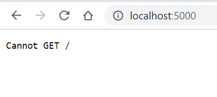

<!-- # MERN Demo (MongoDB, Express.js, React.js, and Node.js) -->
# Node.js Tutorial

* [Node.js Tutorial](#nodejs-tutorial)
* [Introduction](#introduction)
* [What Is Node.js?](#what-is-nodejs)
* [Why Node.js?](#why-nodejs)
* [What Can Node.js Do?](#what-can-nodejs-do)
* [Node.js vs.JS](#nodejs-vsjs)
   * [Browser Vs Server](#browser-vs-server)
* [Install Node](#install-node)
* [Setting up The Server](#setting-up-the-server)
* [Express.js](#expressjs)
* [Routing in Express](#routing-in-express)
   * [Query String Parameters](#query-string-parameters)
   * [Sending JSON](#sending-json)
      * [Sending JSON object from a file](#sending-json-object-from-a-file)
      * [Retrieve results only for valid API keys](#retrieve-results-only-for-valid-api-keys)
* [Heroku](#heroku)
   * [Prerequisites](#prerequisites)
* [In-class Exercise](#in-class-exercise)
* [Deploy your site to Heroku](#deploy-your-site-to-heroku)
* [Client Code](#client-code)
* [Demo](#demo)
* [Check Your Understanding](#check-your-understanding)

---
Check out the complete server code [here](./server/server.js) and client code [here](./client/).

---

All quotes are from w3schools.com.
Also, check this [node.js YouTube course](https://www.youtube.com/watch?v=Oe421EPjeBE&t=19716s&ab_channel=freeCodeCamp.org) for a detailed tutorial of node.js

---

Tutorial Prerequisites
- May be download and install node.js before the class - https://nodejs.org/en/.
- Create an account on https://www.heroku.com/ and download and install Heroku CLI - https://devcenter.heroku.com/articles/heroku-cli


# Introduction
> Node.js is an open source server environment.

> Node.js allows you to run JavaScript on the server.
# What Is Node.js?
> Node.js is an open source server environment
> Node.js is free
> Node.js runs on various platforms (Windows, Linux, Unix, Mac OS X, etc.)
> Node.js uses JavaScript on the server
# Why Node.js?
> Node.js uses asynchronous programming!

# What Can Node.js Do?
> Node.js can generate dynamic page content
> Node.js can create, open, read, write, delete, and close files on the server
> Node.js can collect form data
> Node.js can add, delete, modify data in your database

# Node.js vs.JS
## Browser Vs Server
JavaScript allowed us to build interactive apps by being able to access the DOM. Node.js runs on the server side to allow us to build server side apps that would serve clients apps. Furthermore, it allows us to access files and databases on the server.

# Install Node  
> Download Node.js The official Node.js website has installation instructions for Node.js: https://nodejs.org

# Setting up The Server
- Create a `server` directory using the followig terminal command:
    `nabil828@DESKTOP-0AB0QNR:~/mern_demo$ mkdir server`.
Or use your OS GUI.

# Express.js
Express.js is a Node.js framework that we will use to build the server app. It is defined as
  >Fast, unopinionated, minimalist web framework for Node.js

It allows us to use expressjs `middleware`s which we are going to use to handle session and other web server vital tasks.

- [[Source]](https://expressjs.com/en/starter/installing.html) Install Express using the following commands:

```
nabil828@DESKTOP-0AB0QNR:~/mern_demo/server$ npm init
This utility will walk you through creating a package.json file.
It only covers the most common items, and tries to guess sensible defaults.

See `npm help json` for definitive documentation on these fields
and exactly what they do.

Use `npm install <pkg>` afterwards to install a package and
save it as a dependency in the package.json file.

Press ^C at any time to quit.
package name: (server)
version: (1.0.0)
description:
entry point: (index.js)
test command:
git repository:
keywords:
author: NAbil
license: (ISC)
About to write to /home/nabil828/mern_demo/server/package.json:

{
  "name": "server",
  "version": "1.0.0",
  "description": "",
  "main": "index.js",
  "scripts": {
    "test": "echo \"Error: no test specified\" && exit 1"
  },
  "author": "NAbil",
  "license": "ISC"
}


Is this OK? (yes)
nabil828@DESKTOP-0AB0QNR:~/mern_demo/server$ npm install express --save
npm notice created a lockfile as package-lock.json. You should commit this file.
npm WARN server@1.0.0 No description
npm WARN server@1.0.0 No repository field.

+ express@4.17.1
added 50 packages from 37 contributors and audited 50 packages in 4.488s
found 0 vulnerabilities
```
- Open the server folder using VSCode `atom ~/mern_demo/server` and create a new file `server.js`

- Change the entry point to `server.js` in the `package.josn` file. This the home page of the server when it the http://localhost:port url s requested.  

- [[Source]](https://expressjs.com/en/5x/api.html#express) Create an Express.js application by copying these two line

```js
const express = require('express')
const app = express()
```
into your server.js .

- [[Source]](https://expressjs.com/en/5x/api.html#app.listen) Assign port 5000 to the server using the following code:

```js
app.listen(5000)
```
**OR** even better, add a callback function as a second argument to the previous `listen` function so we can print out any errors on the run time:

```js
app.listen(5000, function(err){
  if(err) console.log(err);
  })
```

- Start the server by typing `$node server.js`
**OR** even better, use `$nodemon server.js` to keep the server running while you are making edits. To install [`nodemon`](https://www.npmjs.com/package/nodemon), run `npm install -g nodemon`.

- Test the server by visiting `http://localhost:5000` in your browser.
You should get the following output:
  
We will fix the server to accept GET request soon 😉.

- You may now add a handle for GET requests:

```js
app.get('/', function (req, res) {
  res.send('GET request to homepage')
})
```
The first argument is the relative path to server homepage.
The second argument is a callback function the will hold the `req` variable for the request object. And the `res` variable for the response object. We use the method `res.send()` to send a message back to the client:

  
You may even embed HTML in your response's string.

---

---
# Routing in Express
So far we had one route to our server. Namely, the '/' route. If we want clients to visit other ~~pages~~ routes, we can handle these requests in such a way:
```
app.get('/contact', function (req, res) {
  res.send('Hi there, here is my <a href="mailto:nabil_alrousan@bcit.ca"> email </a>.')
})
```

Output:

  

Here, `res.send()` method will send a text or HTML response to the client. Alternatively, you can send chunks of your response using `res.write()`s and then signal the end of the response by calling `res.send()`. Check the following example.

## Query String Parameters
You may use

```js
app.get('/', function (req, res) {
    res.write(`Weather of ${req.query["q"]} is 4.8 Celsius. `);
    res.write(`Your API key is ${req.query["appkey"]} . `);
    res.send();
})
```
to read query string parameters send by the client on the server.
Later, we will build a database that we will use to store the weather related info for different cities.

## Sending JSON
You may send JSON object instead of HTML to the client using the `res.json()` method:

```js
app.get('/', function (req, res) {
    res.json(
        {
            "weather": [
                {
                    "temp": 6.7
                }
            ],
            "desc": "cloudy"

        }
    );
})
```

### Sending JSON object from a file
```js
app.get('/', function (req, res) {
    console.log(collection["cities"])
   res.json(collection["cities"].find(
       (city) => city.name == "Vancouver"
   ))
})

```
for the data.js files


```js
collection = {
   "cities":[
      {
         "name":"Vancouver",
         "object":{
            "coord":{
               "lon":-123.1193,
               "lat":49.2497
            },
            "weather":[
               {
                  "id":801,
                  "main":"Clouds",
                  "description":"few clouds",
                  "icon":"02d"
               }
            ],
            "base":"stations",
            "main":{
               "temp":10.7,
               "feels_like":295.51,
               "temp_min":290.72,
               "temp_max":299.8,
               "pressure":1012,
               "humidity":63
            },
            "visibility":10000,
            "wind":{
               "speed":1.79,
               "deg":314,
               "gust":7.15
            },
            "clouds":{
               "all":20
            },
            "dt":1624294720,
            "sys":{
               "type":2,
               "id":2011597,
               "country":"CA",
               "sunrise":1624277221,
               "sunset":1624335698
            },
            "timezone":-25200,
            "id":6173331,
            "name":"Vancouver",
            "cod":200
         }
      },
      {
         "name":"Toronto",
         "object":{
            "coord":{
               "lon":-123.1193,
               "lat":49.2497
            },
            "weather":[
               {
                  "id":801,
                  "main":"Clouds",
                  "description":"few clouds",
                  "icon":"02d"
               }
            ],
            "base":"stations",
            "main":{
               "temp":295.57,
               "feels_like":295.51,
               "temp_min":290.72,
               "temp_max":299.8,
               "pressure":1012,
               "humidity":63
            },
            "visibility":10000,
            "wind":{
               "speed":1.79,
               "deg":314,
               "gust":7.15
            },
            "clouds":{
               "all":20
            },
            "dt":1624294720,
            "sys":{
               "type":2,
               "id":2011597,
               "country":"CA",
               "sunrise":1624277221,
               "sunset":1624335698
            },
            "timezone":-25200,
            "id":6173331,
            "name":"Toronto",
            "cod":200
         }
      }
   ]
}

module.exports = collection


```
Output


now, replace "Vancouver" with a Query string parameter:
http://localhost:5000/?q=Vancouver

```js
app.get('/', function (req, res) {
    console.log(collection["cities"])
   res.json(collection["cities"].find(
       (city) => city.name == req.query["q"]
   ))
})
```
Output


### Retrieve results only for valid API keys
Suppose that the valid API keys are stored in
valid_keys.js

```js
valid_keys = {
    "keys" : [
        "123456",
        "654321"
    ]

}

module.exports = valid_keys;

```

Now in server.js we can modify our route as such:

```js
app.get('/', function (req, res) {
    // console.log(collection["cities"])
    if (valid_keys["keys"].find(
        (key) => key == req.query["appid"]
    )) {

        res.json(collection["cities"].find(
            (city) => city.name == req.query["q"]
        ))
    } else {
        res.status("400").send("Invalid api key");
    }

})
```

If the API key provided by the client does not match the one stored in our database/file, the `400` error will be send back to the user. Another, option is to send back an empty JSON object.


# Heroku
## Prerequisites
You might need the following installed:

[Git installing](https://git-scm.com/book/en/v2/Getting-Started-Installing-Git)

[Heroku CLI](https://devcenter.heroku.com/articles/heroku-cli)

# In-class Exercise
Add new *route*, `/home` that will send the following html snippet to the client requests  

```html
<h1> Home <h1>
<p> This is my first web server! </p>

```

# Deploy your site to Heroku
First change the listening port to

```js
app.listen(process.env.PORT || 5000, function (err) {
    if (err)
        console.log(err);
})
```
so Heroku can set a port number dynamically.

In the terminal in VSCode, execute the following  

```js
git init
```
to initialize  a repository.

and

```
git add .
```
to add all the files to the repository.

and


```
git commit -m "my first commit"
```
to commit.

And

```
heroku login
```
which is going to prompt you to login using the browser.

Next type,
```
heroku create
```
to create a remote repo on Heroku site.

And

```
git push heroku master
```

to sync and push local changes to the remote repo hosted on Heroku.com.

- Check also this
[YouTube Demo](https://www.youtube.com/watch?v=27GoRa4d15c&ab_channel=Vuka)

# Client Code
Use the same client we have implement [last week](./client/). Notice the change in the `url` to point to our new Heroku link of our web server instead of openweathermap.org.

You also need to install the following `cors` package

```
npm install -i cors
```
and add the following to the server code before your routes to force the server to bypass some security checks.

```
const cors = require('cors');
app.use(cors());
```

# Demo
Server Side -
- Unauthorized Access
 - https://sleepy-anchorage-78042.herokuapp.com/
 - https://sleepy-anchorage-78042.herokuapp.com/?q=Vancouver
- Authorized Access
 - https://sleepy-anchorage-78042.herokuapp.com/?q=Vancouver&appid=123456

Client -
https://comp1537-nabil.netlify.app/w10_nodejs-tutorial/client/index.html


# Check Your Understanding
Choose all that apply:
- Express allows you to configure middleware to respond to HTTP requests.
- Express allows you to define a routing table that can work according to the HTTP method and the URL.
- Express makes it possible to render a dynamic HTML page.
- All of these answers.

<details><summary>Answer</summary>

All of these answers.

</details>


Thanks,
<br/>
Nabil
